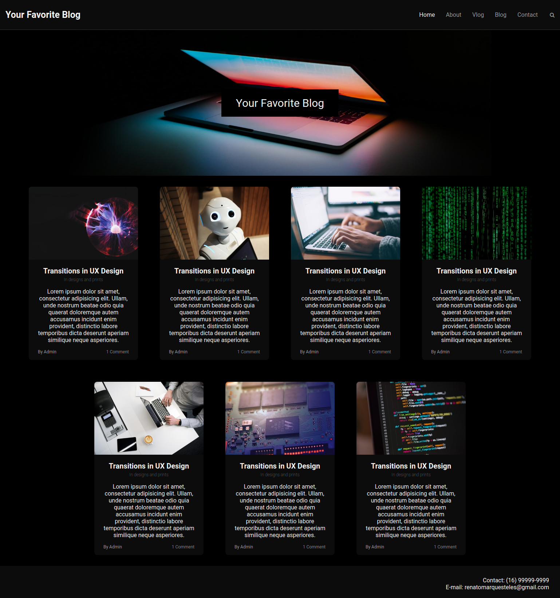

<h1 align="center">
:paperclip: Your Favorite Blog 

  
</h1>

> Página estática desenvolvida durante o programa AceleraDev React da Codenation para consolidar conceitos de HTML5 e CSS3

### Preview

### Instalação
1. Clone este repositório em uma pasta qualquer
2. Abra o arquivo `index.html`
